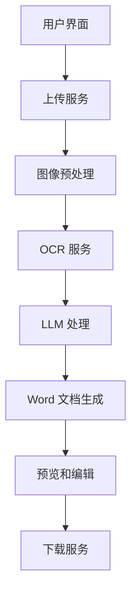

# 简历图像转 Word 文档系统设计

## 1. 系统架构概述

## 2. 核心组件设计

### 2.1 前端界面
- **技术选型**: React + TypeScript
- **主要功能**:
  - 拖拽上传界面
  - 实时预览转换结果
  - 在线编辑器（支持格式调整）
  - 文档下载

### 2.2 图像预处理服务
- **技术选型**: Python + OpenCV
- **功能**:
  - 图像格式转换
  - 图像增强和去噪
  - 倾斜校正
  - PDF 页面提取

### 2.3 OCR 服务
- **技术选型**: Tesseract OCR + PaddleOCR
- **功能**:
  - 多语言文本识别（英文、中文）
  - 版面分析
  - 表格识别
- **优化策略**:
  - 使用 PaddleOCR 作为中文识别主要引擎
  - Tesseract 作为英文识别补充

### 2.4 LLM 处理服务
- **技术选型**: OpenAI GPT-4 API
- **功能**:
  - 文档结构分析
  - 内容分类和标准化
  - 格式优化建议
  - 多语言内容处理
- **处理流程**:
  1. 文本分段和分类
  2. 格式标记识别
  3. 内容清理和标准化
  4. 结构重组

### 2.5 Word 文档生成服务
- **技术选型**: Python-docx
- **功能**:
  - 模板管理
  - 样式配置
  - 多语言字体支持
  - 表格和列表处理

## 3. 数据流程

1. **上传阶段**
   - 支持的文件格式验证
   - 文件大小限制
   - 初步质量检查

2. **预处理阶段**
   - 图像优化
   - 格式统一化
   - 分辨率调整

3. **识别阶段**
   - OCR 文本提取
   - 版面信息保存
   - 置信度评分

4. **LLM 处理阶段**
   - 内容分类
   - 格式识别
   - 文本清理
   - 结构重组

5. **文档生成阶段**
   - 样式应用
   - 格式设置
   - 质量检查

6. **编辑和导出阶段**
   - 用户校对
   - 格式微调
   - 导出确认

## 4. 技术挑战和解决方案

### 4.1 OCR 准确性
- **挑战**: 复杂版面和多语言混排的识别准确性
- **解决方案**:
  - 组合使用多个 OCR 引擎
  - 基于语言特征的文本分流处理
  - 使用 LLM 进行后处理纠错

### 4.2 格式保持
- **挑战**: 保持原始简历的格式和样式
- **解决方案**:
  - 版面分析算法
  - 智能模板匹配
  - 样式映射系统

### 4.3 多语言支持
- **挑战**: 中英文混排的处理
- **解决方案**:
  - 语言识别和分段处理
  - 专用字体配置
  - 智能段落重排

## 5. 部署架构

### 5.1 容器化部署
- Docker 容器化各服务组件
- Kubernetes 编排管理
- 自动扩缩容配置

### 5.2 服务器配置
- API 服务器
- OCR 处理服务器
- LLM 服务器
- 文档转换服务器
- 静态资源服务器

### 5.3 存储方案
- 对象存储：原始图片和生成文档
- Redis：缓存和会话管理
- PostgreSQL：用户数据和转换记录

## 6. 安全考虑

- 文件上传验证
- 内容加密存储
- 用户数据保护
- 访问权限控制
- API 认证和限流

## 7. 监控和维护

- 服务健康检查
- 性能监控
- 错误追踪
- 用户反馈收集
- 系统日志分析

## 8. 后续优化方向

1. **识别准确性提升**
   - 模型训练和优化
   - 错误模式分析
   - 反馈学习机制

2. **性能优化**
   - 处理速度提升
   - 资源使用优化
   - 并发处理能力

3. **用户体验改进**
   - 界面优化
   - 操作流程简化
   - 智能推荐功能

4. **功能扩展**
   - 更多文档格式支持
   - 批量处理能力
   - 自定义模板系统